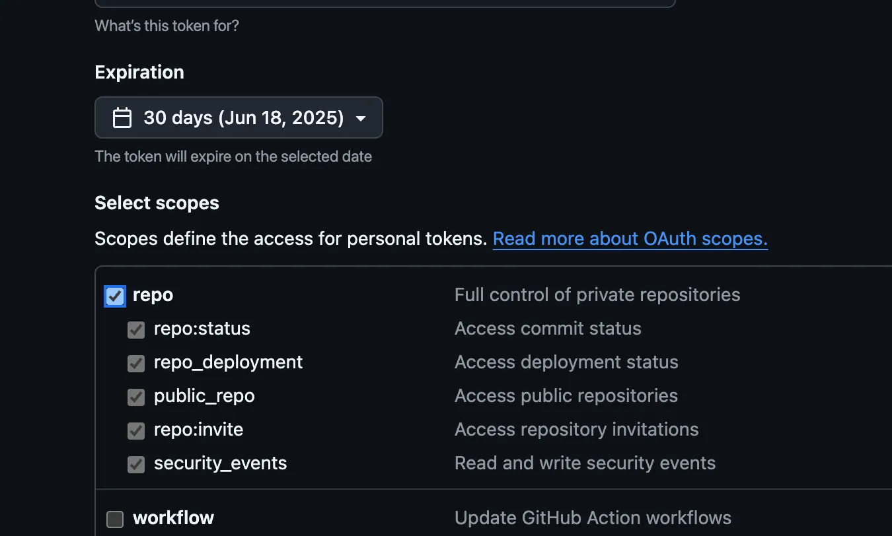
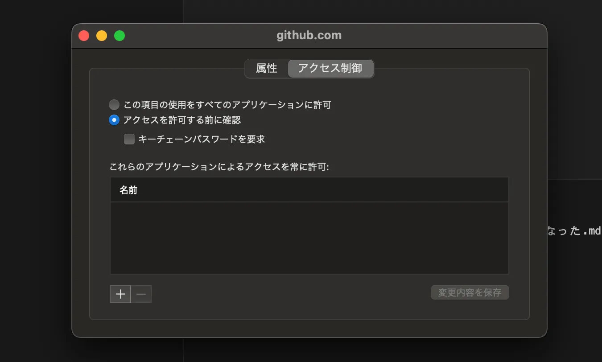

# プッシュができなくなった
## 問題
`git push origin トピックブランチ`を実行したら、
```
Missing or invalid credentials.
Error: connect ECONNREFUSED /run/user/1000/vscode-git-ab34f01ba9.sock
    at PipeConnectWrap.afterConnect [as oncomplete] (node:net:1611:16) {
  errno: -111,
  code: 'ECONNREFUSED',
  syscall: 'connect',
  address: '/run/user/1000/vscode-git-ab34f01ba9.sock'
}
remote: Invalid username or password.
fatal: Authentication failed for 'https://github.com/....git/'
```
のエラーが起き、プッシュできなくなった。

## 原因
### まえおき
awsをvscodeのremoteSSHで接続しており、接続はvscodeバージョンに依存している。1.99以上になるとアクセスできなくなるようだ。

バージョンをアップデートしたせいで、vscodeを再インストールしなければならなった。<br>
再インストールする際に、前のvscodeのキャッシュが原因でvscodeがクラッシュしてしまった。

これの対処として、
```
rm -rf ~/Library/Application\ Support/Code
rm -rf ~/Library/Caches/com.microsoft.VSCode
rm -rf ~/.vscode
```
を実行した。

### 原因1
ユーザー名が一致していなかった。
githubのアカウント名が`kkraoi`であるのに対し、
```
git config --global user.name
↓
aoi_xxxxxx
```
であった。

「git config user.name」は何？<br>
=> Git のローカル設定上の「コミット署名者名」

ちなみにメールアドレス（`git config --global user.email`）はgithubアカウントのものと一致していた。

### 原因2
macOS がキーチェーンに保存された古いトークンを使う可能性がある。

キーチェーンはパスワードや証明書を安全に保存・管理するための仕組み。
| 目的          | 内容                                     |
| ----------- | -------------------------------------- |
|パスワードの保管  | Webサイト、Wi-Fi、メール、アプリなどのパスワードを安全に保存     |
|トークンや鍵の保管 | GitHub のトークン（PAT）、SSH 鍵、証明書など          |
|アプリ間の自動連携 | Safari や VSCode などのアプリが保存済みの情報を自動利用できる |
|セキュアに管理   | 暗号化され、macOS にログインしているユーザーしかアクセスできない    |

### 原因3
キャッシュの削除により、アクセストークンが消えた。そこでトークンをNew personal access token (classic)で作るのだが、この時、`[ ] repo`以下にチェックを入れていなかった。

これが正解↓


repo スコープは、プライベート／パブリック両方のリポジトリに対する操作を制御する。このスコープを付けなかった場合、プライベートリポジトリへの push/pull がブロックされる。

### 原因4
直接的な原因ではないが、沼った原因として...。<br>
リモート(aws)とローカルの意識が足りなかった。リモートはリモートで、gitの設定(git config --global)をしているのだ。自分のPCでgitを弄っていたので、リモート(aws)とローカルのgitの設定は同じものだと勘違いしていた。

リモートは、`git config --global credential.helper` は `store`になっておかねばならない。<br>
`osxkeychain`に設定してはいけない。だってこれは、macOSのキーチェーンだからね。これにすると、awsはlinuxだから、キーチェーンなんてものは存在せず、アクセストークンを求めるモードになる。つまり、プッシュなどの際に毎回認証が起こる(認証の自動化=キーチェーンが発生しない)。

## 対処

### 原因1の対処
`git config --global user.name`で結果が、アカウント名と一致していなかったら、
```
git config --global user.name "アカウント名"
```
にする。

ちなみに、`git config --global --list`でGit のグローバル設定（全リポジトリで適用される設定）を一覧表示することができる。

### 原因2の対処
キーチェーン > github.com > アクセス制御 にて、既存の設定を削除する。

これが正解↓


### 原因3の対処
キャッシュを削除したことにより、アクセストークンが無効になった可能性がある。

トークンを、下記から新しく作る。
https://github.com/settings/tokens

```
git config --global credential.helper store
```
を実行して、認証要求モードに切り替える。これでプッシュをすると、エラーを吐く代わりに、アクセストークン(=password)が要求されるようになる。<br>
ちなみに`export GIT_ASKPASS=`でCLI認証に切り替えることもできる。

新たに作ったトークンをペーストすると無事にプッシュすることができる。